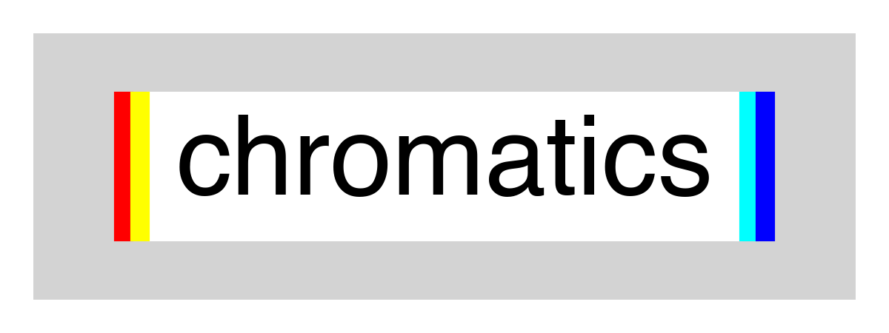

*chromatics* is a simple Python library for analyzing chromatographic data.

*chromatics* is designed to allow for simple analysis of SFC-MS data. 
In particular, *chromatics* simplifies analysis of overlapped chromatographic peaks 
by using modern non-linear curve fitting algorithms (as implemented in *lmfit*) to fit the observed chromatogram to a linear combination
of parametric peak models.

For an example of how to use *chromatics*, see ``tutorial/tutorial.ipynb``.

Please cite as: Wagen, C. C. *chromatics* **2020**, www.github.com/corinwagen/chromatics.

This library is released under a GPL 3.0 license: see ``LICENSE.txt`` for more details

*Corin Wagen, Eugene Kwan, Spencer McMinn, and Eric Jacobsen, 2022*
